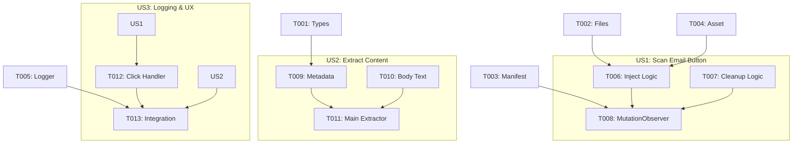

# Implementation Tasks: Gmail Email Extraction

**Feature Branch**: `001-gmail-email-extraction`
**Status**: Draft

## Implementation Strategy

We will build the extension incrementally, starting with the core infrastructure (Phase 1 & 2), followed by the primary User Stories in priority order. 
- **MVP Scope**: User Story 1 (Scan Email Button) and User Story 2 (Extract Email Content), outputting to a basic console log.
- **Incremental Delivery**: User Story 3 will refine the logging into a structured group, and User Story 4 wraps up the developer experience and documentation.

## Phase 1: Setup

These tasks initialize the core file structure, types, and manifest configurations required for the extension.

- [x] T001 [P] Create `src/types/email.ts` and define `EmailData` and `ExtractionResult` interfaces based on data-model.md
- [x] T002 [P] Create initial empty files for `src/content/index.ts`, `src/content/icon-injector.ts`, and `src/content/email-extractor.ts`
- [x] T003 Update `manifest.config.ts` to register `src/content/index.ts` as a content script matching `https://mail.google.com/*` with `run_at: "document_idle"`
- [x] T004 [P] Add a simple shield SVG icon for the extension to `src/assets/icon.svg`

## Phase 2: Foundational

Blocking prerequisites that must be completed before implementing user stories.

- [x] T005 [P] Implement `src/utils/logger.ts` with functions for grouped console logging (`console.group`, `console.log`, `console.warn`, `console.groupEnd`)

## Phase 3: User Story 1 - Scan Email Button (Priority: P1)

**Goal**: Inject the CheckMailPlugin icon into Gmail's email toolbar, dynamically responding to DOM changes and thread expansion.
**Independent Test Criteria**: Open any email or thread in Gmail; the icon should appear near "Print all" for each expanded message. It should not appear in the inbox list view.

- [x] T006 [P] [US1] Implement DOM logic in `src/content/icon-injector.ts` to locate expanded message toolbars and inject the icon (use `src/assets/icon.svg`, set `title="Scan with CheckMail"` tooltip per FR-008)
- [x] T007 [P] [US1] Implement cleanup logic in `src/content/icon-injector.ts` to remove stale, duplicate, or collapsed message icons
- [x] T008 [US1] Implement a `MutationObserver` in `src/content/index.ts` to watch `document.body` for DOM changes and trigger the injection/cleanup logic

## Phase 4: User Story 2 - Extract Email Content (Priority: P1)

**Goal**: Extract visible email metadata (sender, recipients, subject, date, body text) from the DOM.
**Independent Test Criteria**: Trigger text extraction programmatically on various emails and verify the `EmailData` object correctly captures the fields.

- [x] T009 [P] [US2] Implement metadata extraction (from, to, cc, subject, date) from Gmail's DOM within specific message containers in `src/content/email-extractor.ts`
- [x] T010 [P] [US2] Implement body text extraction in `src/content/email-extractor.ts` using `innerText` and link preprocessing (formatting `<a>` hrefs)
- [x] T011 [US2] Create the main `extractEmailContent(messageContainer)` function in `src/content/email-extractor.ts` combining metadata and body extraction, returning an `ExtractionResult`

## Phase 5: User Story 3 - Log Extracted Data for Inspection (Priority: P1)

**Goal**: Output the extracted data to the DevTools console when the user clicks the icon.
**Independent Test Criteria**: Click the injected icon on multiple emails and observe separate, structured `[CheckMailPlugin] Email Extraction` console groups.

- [x] T012 [US3] Add a click event listener to the injected icon button in `src/content/icon-injector.ts`
- [x] T013 [US3] Connect the click handler to call `extractEmailContent` (T011) and pass the `ExtractionResult` to the logging utility (T005)

## Phase 6: User Story 4 - Extension Installation & Setup (Priority: P2)

**Goal**: Ensure the extension can be easily built, sideloaded, and runs without errors.
**Independent Test Criteria**: Follow the README instructions to build and sideload the extension with no console errors and minimal permissions.

- [x] T014 [US4] Review and update `vite.config.ts` if needed to ensure exact compatibility with `@crxjs/vite-plugin` and content script bundling
- [x] T015 [US4] Copy the contents of `quickstart.md` into the main project `README.md`, replacing existing scaffolding

## Phase 7: Polish & Cross-Cutting Concerns

- [x] T016 Implement visual feedback (e.g., opacity change) on the icon during extraction and on completion in `src/content/icon-injector.ts`
- [x] T017 Run `npm run check` and resolve any TypeScript or Svelte linting errors across the project
- [x] T018 Test edge cases identified in spec.md: empty body, multiple tabs, preview pane mode

## Dependencies & Execution Order

**Parallel Execution Examples**:
- `T006` (Inject Logic), `T009` (Metadata Extractor), and `T005` (Logger) can be developed completely independently.
- `T009` and `T010` (the two extraction pieces) can be divided between developers.
